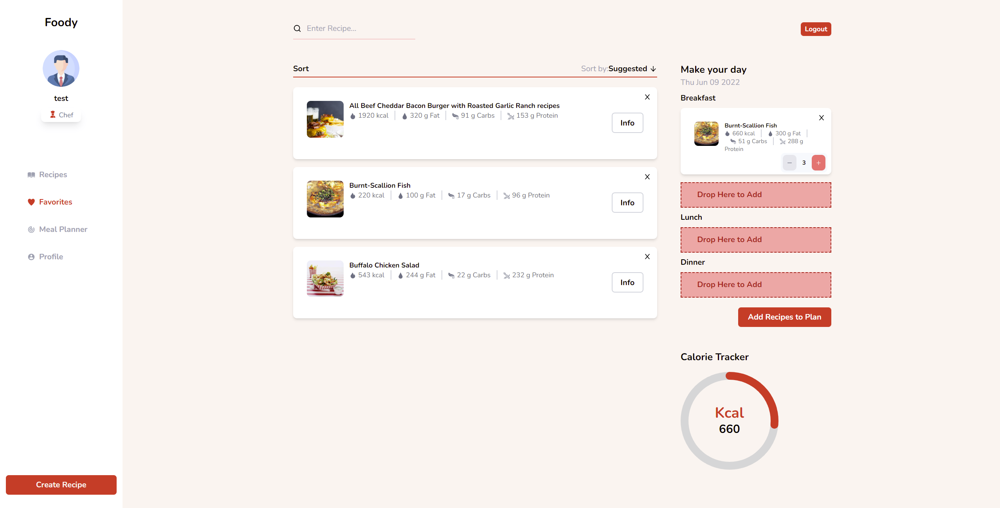

# Recipe Web App
A fully functional mern stack web app for recipes, meal planning, and recipe sharing. Users can save recipes and then drag and drop saved recipes into a weekly meal plan. According to added recipes users can check the weekly summary that shows nutrition and calorie counts.
## Features
 * Create and Delete Recipe.
 * Save recipe.
 * Drag and drop saved recipes into daily plan.
 * Calculate daily taken calories.
 * Add dragged recipes into meal plan.
 * Show recipes.
 * Filter and search recipe.
 * Remove recipes from meal planner.
 * Calculate weekly nutrition summary and BMI based on meal planner.
 * Select week for weekly summary.
 * Profile page
 * Update account info
 * JWT Authentication
 * Sorting

## Tech
  * React
  * Express
  * MongoDB
  * Mongoose
  * NodeJS
  * Tailwind
## Hosting
 * Digital Ocean Linux Server
 * Nginx - Web Server
 * PM2 - Process Manager
 * CI/CD - Github actions self hosted runner
 * MongoDB Atlas - Cloud DB

## Screenshots

 
